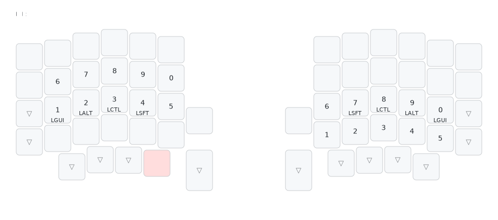
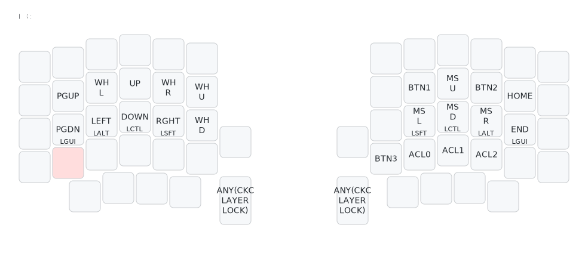
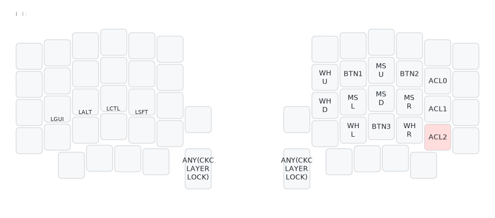
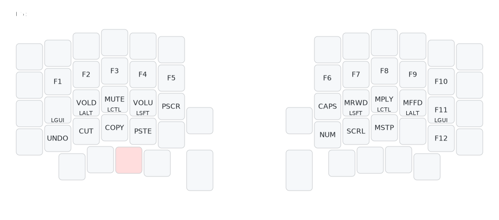

# Keymap

## Editing

Keymap is defined in `keymap.json` and can be edited via QMK Configurator, but using numbered layers instead of named ones (limitation from QMK Configurator). A `keymap.c` file will be generated automatically in the build process.

Custom keycodes and common values shall be defined in 'sofle/sofle.h' which be included in the generated C keymap file.

Custom logic shall be defined in `base_keymap.c`.

## Layers

### Base layer / L0

- QWERTY based
- ,/< ./> '/" `/~ symbols only
- GACS home row mods
- used more as a 36 layout
- symmetric layer access from thumb cluster mod taps
    - outer thumb to Function layer
    - middle thumb to Number layer
    - inner thumb to Symbol layer
- pinky -1 row mod tap to Navigation Layers 
- legacy number row
- legacy SCGA mods on outer column / thumb cluster

### Number layer / L1

### Symbol layer / L2

- inspired from https://sunaku.github.io/moergo-glove80-keyboard.html, adapted to a 3x5x2 layout and grouped in meaningful clusters
- left hand:
    - () : VIM previous/next sentence
    - ;, : VIM previous/next search result from f/F
    - [] : VIM previous/next code blocks, errors, warnings, paste boundary etc
    - {} : VIM previous/next paragraph
    - :; : vertical stacked due to similarity, shifted top-down roll
    - ., : vertical stacked due to similarity
    - &| : logical cluster
    - @ : clusterless
    - % : clusterless, VIM jump to matching element
    - ();, : function call inward roll
- right hand:
    - ^$ : VIM/regex BOL/EOL
    - #* : VIM search word under cursor backward/forward
    - ?/ : VIM input search backward/forward, shifted top-down roll
    - <-=> : comparison/arrow cluster
    - += : shifted top-down roll
    - \/ : slash cluster
    - !? : interrobang cluster
    - -_ : shifted top-down roll

### Basic navigation + Numpad layer / L3

- layer locking
- future improvements:
    - [ ] next/previous word jump?

## Mouse navigation layer / L4

- layer locking
- future improvements:
    - [ ] mouse hold/release?

### Function layer / L5

### Adjust layer / L6

- toggle to switch to Mac modifier layout with CAGS on home row mods (Ctrl-Gui swap) and SCAG mods on outer column / thumb cluster (Alt-Gui swap) on all layers where mods are used
